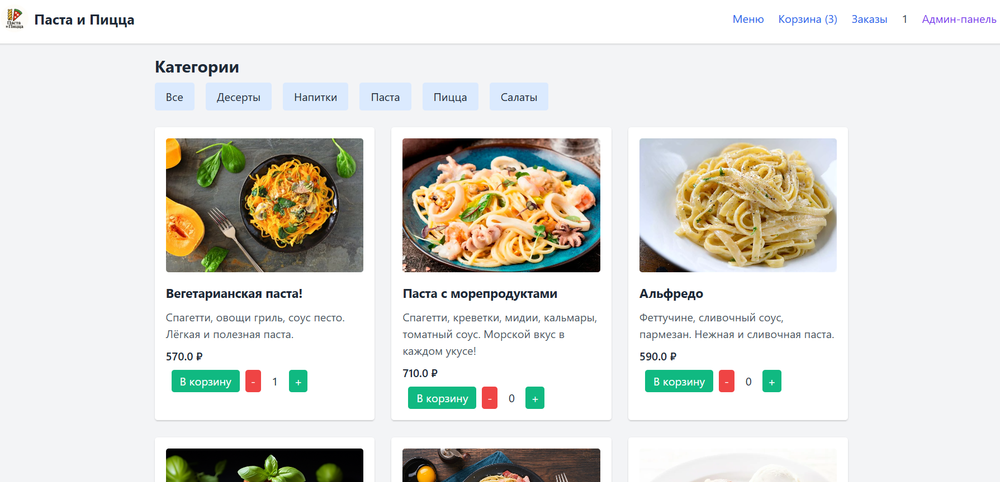
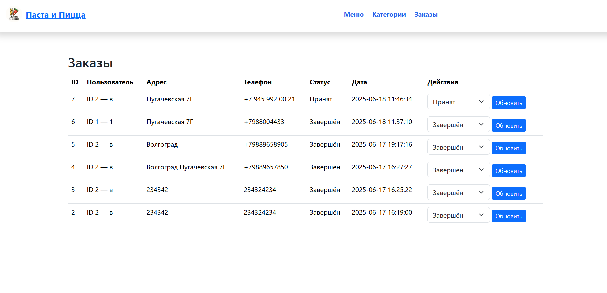
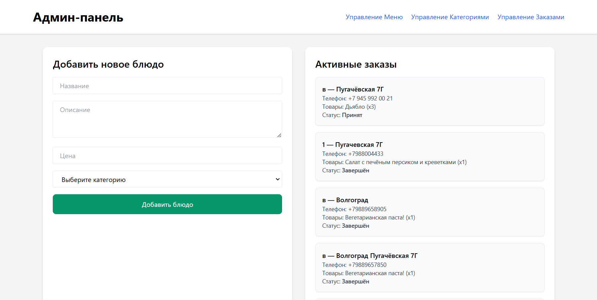

# 🍕 Web_Rest — Итальянская кухня онлайн

**Это веб-приложение на Flask для онлайн-заказа вкуснейшей итальянской кухни: свежей пиццы и ароматной пасты прямо домой!**

---

## 🚀 Взгляните на интерфейс

<p align="center">
  
  <br>
  <em>Главная страница — категории и блюда</em>
</p>

<p align="center">
  
  <br>
  <em>Корзина и оформление заказа</em>
</p>

<p align="center">
  
  <br>
  <em>Админ-панель для управления меню и заказами</em>
</p>

---

## 📝 Возможности

- Просмотр меню с категориями блюд
- Регистрация и авторизация пользователей
- Добавление блюд в корзину и оформление заказа
- Оставление отзывов на блюда
- Удобная админка для управления меню и заказами

---

## ⚙️ Как запустить

1. **Клонируйте репозиторий**
   ```bash
   git clone https://github.com/Dienly-Bogdan/Web_Rest.git
   cd Web_Rest
   ```

2. **Создайте и активируйте виртуальное окружение**
   ```bash
   python -m venv venv
   # Windows:
   venv\Scripts\activate
   # Mac/Linux:
   source venv/bin/activate
   ```

3. **Установите зависимости**
   ```bash
   pip install -r requirements.txt
   ```

4. **Инициализируйте базу данных**
   ```bash
   flask --app src/app.py init-db
   ```
   или  
   ```bash
   python src/create_db.py
   ```

5. **Запустите приложение**
   ```bash
   flask --app src/app.py run
   ```
   или  
   ```bash
   python src/app.py
   ```
   По умолчанию приложение доступно на [http://127.0.0.1:5000](http://127.0.0.1:5000)  
   (или на другом порту, если указан в app.py)

---

## 📁 Структура проекта

```
Web_Rest/
├── venv/                     # Виртуальное окружение (не отслеживается Git)
├── requirements.txt          # Зависимости Python
├── README.md                 # Документация проекта
├── static/                   # Статические файлы (CSS, JS, изображения, скриншоты README)
│   └── readme_screens/
├── src/                      # Исходный код приложения
│   ├── app.py                # Основной файл Flask-приложения
│   ├── database.py           # Работа с базой данных
│   ├── create_db.py          # Скрипт для инициализации БД
│   ├── schema.sql            # Схема базы данных
│   ├── pasta_pizza.db        # Файл базы данных (создается автоматически)
│   ├── templates/            # HTML-шаблоны Jinja2
│   │   └── ...html
│   └── static/               # Статика, если требуется для работы именно Flask (обычно пусто, используется корневая static)
└── .gitignore
```

> **Важно:**  
> - Запускать инициализацию базы и сервер нужно из папки `src` (или указывать путь через флаг `--app`).
> - Все основные файлы приложения лежат в папке `src`.

---

## 🤝 Контрибьютинг

PR и идеи приветствуются!

---

**Приятного пользования и buon appetito! 🍝**